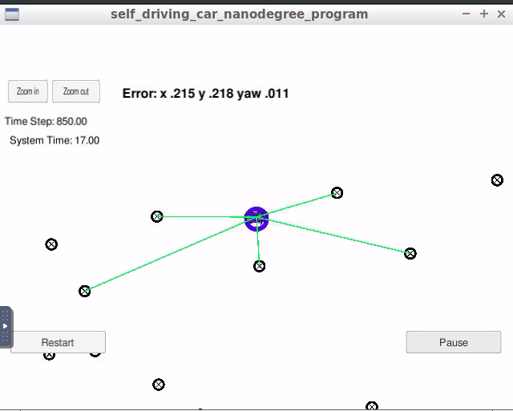

# Overview
This repository contains all the code needed to complete the final project for the Localization course in Udacity's Self-Driving Car Nanodegree.
Here it is possible to see the results of the filter while running the simulator:

## Project Introduction
Your robot has been kidnapped and transported to a new location! Luckily it has a map of this location, a (noisy) GPS estimate of its initial location, and lots of (noisy) sensor and control data.

In this project a 2 dimensional particle filter is implemented in C++. The particle filter will be given a map (containing landmarks positions) and some initial localization information (analogous to what a GPS would provide). At each time step the filter will also get observation and control data and will provide the best candidate for the vehicle position estimate (x,y position on map and heading angle).
In the video above this best candidate is depicted with a blue circle, that, when the estimation is accurate, should be around the ego-vehicle.

## Project Description

In this section the steps necessary to implement the particle filter are summarized: 

* **Initialization**: At the initialization step we estimate our position from GPS input, in other word a (noisy) GPS measurements is used to initialize all the particles.
* **Prediction**: The second step is to use a bicycle motion model to predict where each particle will be at the next time step. This is achieved by updating the particles based on yaw rate and velocity of the vehicle (always accounting for Gaussian sensor noise).
* **Update**: During the update step, the particle weights are updated using map landmark positions and feature measurements. This is the most complex step and it can be described by the following sub-tasks done for each particle:
    1) Transform measurements from the car in map coordinate system (using the homogeneous transformation)
    2) Find the landmarks in the map that are in the sensor range field of view
    3) Associate the map landmarks (in range) with the observations (using the nearest neighbor approach)
    4) Update the weight of each particle computing the product of each measurement's Multivariate-Gaussian probability density (see the end of the README for more details from the class).
* **Resample**: In this final step new particles are generated with a probability proportional to their weight.

In the video above the error is calculated between the best estimated particle and a groundtrouth information containing the real state of the vehicle. The shown values are in meters for x,y and in radians for the heading angle.

## Running the Code
This project involves the Term 2 Simulator which can be downloaded [here](https://github.com/udacity/self-driving-car-sim/releases)

This repository includes two files that can be used to set up and install uWebSocketIO for either Linux or Mac systems. For windows you can use either Docker, VMware, or even Windows 10 Bash on Ubuntu to install uWebSocketIO.

Once the install for uWebSocketIO is complete, the main program can be built and ran by doing the following from the project top directory.

1. mkdir build
2. cd build
3. cmake ..
4. make
5. ./particle_filter

Alternatively some scripts have been included to streamline this process, these can be leveraged by executing the following in the top directory of the project:

1. ./clean.sh
2. ./build.sh
3. ./run.sh

[Here](https://github.com/udacity/CarND-Kidnapped-Vehicle-Project/blob/master/README.md) is the link to the original README.md from Udacity with other useful information on the project. 

#### Helper note for the update step previously described: The Multivariate-Gaussian probability density has two dimensions, x and y. The mean of the   Multivariate-Gaussian is the measurement's associated landmark position and the Multivariate-Gaussian's standard deviation is described by our initial uncertainty in the x and y ranges. The Multivariate-Gaussian is evaluated at the point of the transformed measurement's position. The formula  for the Multivariate-Gaussian can be seen below.